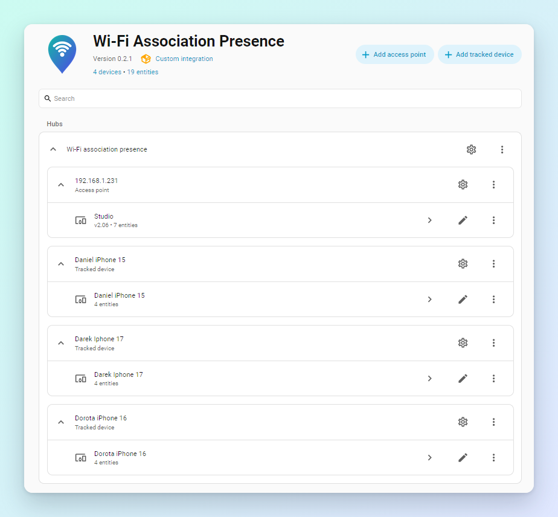
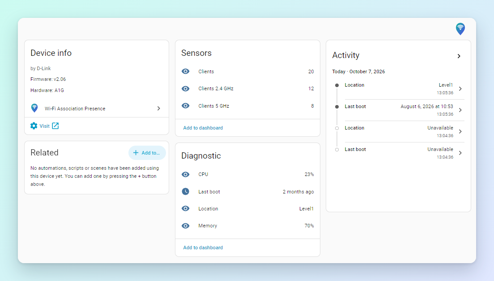
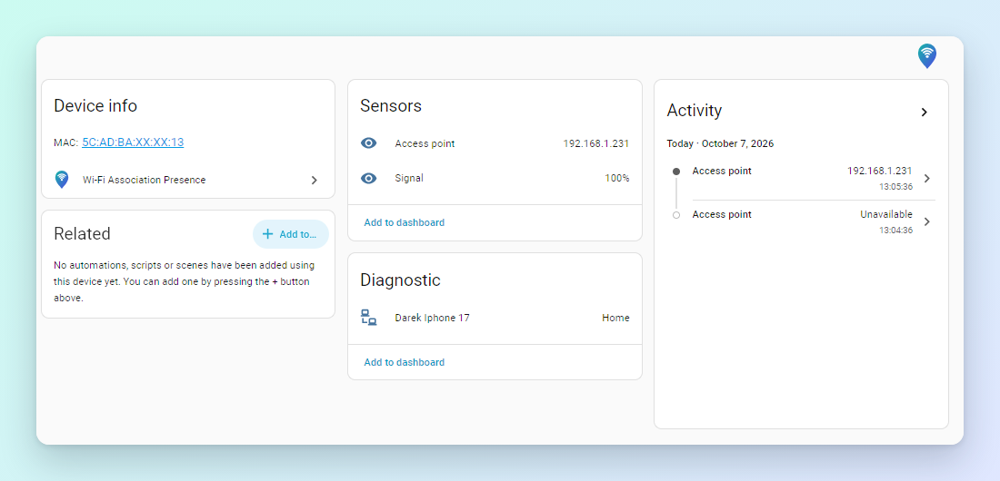

# Wi-Fi Association Presence

**Who is home, and near which access point, straight from your Wi-Fi access points.**

A Home Assistant integration that reads the **association tables** of your access points:
the list of devices that are authenticated and joined to each radio right now. Each phone,
tablet or laptop you track becomes a device in Home Assistant with:

- a **presence tracker** (`home` / `not_home`) that holds steady while the phone sleeps,
- the **access point** it is connected to and its **signal**,
- the **area** it is in, taken from the area you assigned to that access point.

Each access point becomes a device too, with client counts, firmware, CPU, memory and uptime.

> **Status:** early development (0.3.x). Supports **D-Link DAP** access points (tested
> with DAP-2610 and DAP-3662) on Home Assistant 2026.9+. More vendors can be added through
> pluggable drivers; see [Help add your access point](#help-add-your-access-point).

## Why association, not ARP or MAC tables

Most network-based presence trackers look at a router's **ARP table**, a switch's
**MAC address table**, or ping the device. All of these only notice a phone while it is
*sending traffic*, and phones go quiet for minutes at a time to save battery. The result
is the familiar flapping: home, away, home, while the phone sat on the table.

An access point knows something more fundamental: whether the device is **associated**,
i.e. still joined to the Wi-Fi network. A sleeping phone stays associated. It only
disassociates when it really leaves (or Wi-Fi is turned off).

| | ARP table | Switch MAC table | Ping | **AP association** |
|---|---|---|---|---|
| Sees an idle, sleeping phone | ✗ entries age out | ✗ entries age out | ✗ often no reply | **✓ stays associated** |
| Knows *where* in the house | ✗ | ✗ | ✗ | **✓ which AP, so which area** |
| Signal strength | ✗ | ✗ | ✗ | **✓** |
| Wired devices | ✓ | ✓ | ✓ | ✗ Wi-Fi only |

On top of that, a short **grace period** (default 3 minutes) bridges roaming between APs
and brief gaps, so `not_home` means *gone*, not *quiet*.

## Features

### Presence that doesn't flap
- One tracker per device, **across all your access points**: `home` while associated to
  any of them, `not_home` once missing for longer than the grace period.
- **Roaming aware**: a device seen on two APs in the same poll is placed on the one with
  the stronger signal.
- **Adjustable grace period** (0–3600 s) for phones that drop Wi-Fi in deep sleep.

### Room-level location with areas
- Assign each access point device to a Home Assistant **area** (Living room, Studio,
  Garden...). Every tracked device then gets an **Area** sensor showing the area of the
  access point it is connected to, with a stable `area_id` attribute.
- Use it in automations: *lights on in the studio when my phone joins the studio AP*,
  *notify when the kids' tablets are in the garden*, *which floor is everyone on*.
- It reacts immediately when you move an AP to another area or rename an area.

### Per device insight
Each tracked device is a Home Assistant device with:
- **Tracker** with attributes `access_point`, `area`, `ssid`, `band`, `signal`,
  `signal_unit`, `last_seen` (kept after the device leaves, as "last seen at").
- **Access point** sensor: the AP's name (yours, or the name the AP reports, e.g. *Studio*).
- **Signal** sensor: signal quality 0-100 %, comparable across access points and vendors
  (percent as reported by D-Link; dBm from other drivers is converted), with a matching
  Wi-Fi strength icon. The raw value and its unit are in the tracker's attributes.
- **Area** sensor, as above.

### Access point monitoring
Each access point is a Home Assistant device with firmware, hardware revision, model, a
link to its web UI, and sensors:
- **Clients 2.4 GHz**, **Clients 5 GHz** and **Clients** (total).
- Diagnostics: **CPU**, **Memory**, **Last boot**, **Location**.
- SSID names resolved from the AP (not just "SSID index 3").

### Easy and robust
- **Set up entirely in the UI.** Access points and tracked devices are entries of the
  integration: add, edit and remove them from its page. Pick devices to track from a list
  of what is associated right now.
- **Fault tolerant.** An unreachable, slow or misbehaving access point only affects itself:
  its sensors go unavailable and its clients age out after the grace period, while the
  other APs keep updating. Unexpected replies are discarded, not shown as values.
- **Independent trackers.** Trackers are keyed by MAC address only, so you can remove,
  replace or change the type of an access point without losing them.
- **Pluggable drivers.** Each AP model is a small driver with its own connection policy;
  new vendors can be added without touching the rest.

## Screenshots

The integration page: one hub, with access points and tracked devices as entries. The
access point shows as *Studio*, the name it reports about itself.



An access point device: firmware, hardware, client counts per band, CPU, memory, last boot.



A tracked device: its tracker, the access point it is connected to, the area of that
access point, and the signal.



## How presence is decided

Every 60 seconds all access points are read in parallel (one SSH login per AP per poll).
A device seen on two APs in the same poll (while roaming) is attributed to the one with
the stronger signal.

| Situation | Tracker state |
|---|---|
| Associated to any AP now | `home` |
| Not seen for less than the grace period | still `home` |
| Not seen for longer than the grace period | `not_home` |
| No access point configured | `unknown` |
| No access point could be read at all | unavailable |

Tracked devices are independent of access points. Removing, replacing or changing the
type of an access point doesn't touch them.

## Installation

Requires Home Assistant **2026.9** or newer.

**HACS:** HACS → ⋮ → **Custom repositories** → add this repository's URL with type
**Integration**, install **Wi-Fi Association Presence**, and restart Home Assistant.

**Manual:** copy `custom_components/wifi_association_presence` to
`/config/custom_components/` and restart Home Assistant.

## Setup

1. **Settings → Devices & services → Add integration → Wi-Fi Association Presence.**
2. On the integration page, **Add access point**: choose the type, then its settings.
   The settings are tested by reading the AP once. Leave the name empty to use the name
   the AP reports about itself (D-Link: its system name, e.g. "Studio").
3. Open each access point's device and set its **Area** (✏️ → Area). This is what the
   trackers' *Area* sensor reports.
4. **Add tracked device**: pick a device from the list or type its MAC address, and give it
   a name. The list holds every device seen in the last 7 days, most recent first, labelled
   with AP, band, SSID and signal; devices not connected right now (a sleeping car or
   tablet) show when they were last seen. This memory survives restarts.
5. Optional: **Configure** on the hub sets the grace period.

Access points and tracked devices can be edited from their **⋮** menu (**Reconfigure**).
Leaving an access point's password empty keeps the current one.

## Supported access points

| Type | Models | Method |
|---|---|---|
| D-Link DAP (SSH console) | **Tested:** DAP-2610 (fw v2.06, [report](docs/ap-reports/dlink-dap-2610-v2.06.txt)), DAP-3662. **Likely:** other DAP models with the same CLI | SSH: `config wlan 0/1` + `get clientinfo` |

### D-Link DAP setup notes

- Enable SSH under **Maintenance → Administration → Console Settings** (protocol SSH).
- The AP only supports password login. Limit management access with
  **Limit Administrator** to your Home Assistant host.
- `get clientinfo` lists the radio selected with `config wlan 0` (2.4 GHz) or
  `config wlan 1` (5 GHz); `set band` does not change it. The `config wlan` command is
  missing from the AP's own `help` output but documented in D-Link's CLI manuals.

## Limitations

**Access point support**
- **D-Link DAP only.** No other vendor or model has a driver yet. Support for more depends
  on owners contributing data (see below); the driver interface is designed for it.
- **What the D-Link CLI provides is about all there is.** On the tested firmware it gives
  the client list per radio (MAC, SSID, signal, connected time), SSID names, system
  name, location, firmware, hardware revision, uptime, CPU and memory. It does **not**
  report:
  - the model (enter it in the access point's settings if you want it on the device);
  - the AP's MAC address (`get macaddress` fails on this firmware);
  - clients' IP addresses or host names, so trackers have no `ip`/`host_name`, and Home
    Assistant features that rely on a tracker's IP aren't available.
- Signal quality is an approximation: D-Link reports a percentage, and dBm values are
  mapped linearly (-100 dBm = 0 %, -50 dBm = 100 %).

**Presence**
- **Wi-Fi only.** Wired devices, and devices on networks served by other equipment, are
  not seen.
- **Detection delay:** arriving is detected within one poll (up to 60 s); leaving takes
  the grace period plus up to one poll. The poll interval is fixed by design (Home
  Assistant integrations don't expose polling intervals); the grace period is adjustable.
- **Private / randomized MAC addresses:** track the address the device uses on *your*
  network (phones show it per network). Devices that rotate their address periodically
  (e.g. iOS "Rotating" private address) will stop matching; set them to a fixed private
  address for your network.
- **Devices that drop Wi-Fi to save power** (some Android phones, laptops in sleep)
  disassociate and will show as away unless the grace period covers the gap.

**Security**
- The D-Link units only offer password login and old SSH algorithms
  (`diffie-hellman-group14-sha1`, `diffie-hellman-group1-sha1`, `ssh-rsa`, CBC ciphers).
  The driver enables those for these units only, and does **not verify the host key**
  (it changes on factory reset). Keep management access restricted to the Home Assistant
  host and preferably on a trusted network segment.
- The AP password is stored in Home Assistant's configuration storage, like other
  integrations' credentials.
- Each poll is a console login; the AP may log every login (syslog noise).

**Project state**
- Early development: limited testing (two AP models, one installation), English only, not
  in the default HACS list (add it as a custom repository).

## Help add your access point

You don't need to write code to get an access point supported. Run the collector against
it and attach the report to a
[New access point model](../../issues/new?template=new_access_point.yml) issue:

```bash
pip install asyncssh
python3 scripts/collect.py --host <AP IP> --username <user>
```

- It runs **read-only commands only** (anything that could change settings is refused)
  and **redacts** MAC addresses (vendor prefix kept), IP addresses and secret-looking
  settings. Review the report before sharing it.
- `--legacy-ssh` allows old SSH algorithms if the connection fails.
- `--command "<cmd>"` (repeatable) adds the command your AP uses to list clients.
- `--profile dlink_dap` uses the D-Link command list; `--list-profiles` shows all.

Example: [`docs/ap-reports/dlink-dap-2610-v2.06.txt`](docs/ap-reports/dlink-dap-2610-v2.06.txt)
is the report the D-Link driver was checked against (DAP-2610, firmware v2.06,
`--profile dlink_dap --legacy-ssh`). It shows the command list, the client table for each
radio, and how redaction looks. Reports for supported models are kept in
[`docs/ap-reports/`](docs/ap-reports) as reference data for driver and parser work.

Currently the collector only supports SSH consoles. If your AP lists clients only in its
web UI or over SNMP, say so in the issue.

## Development

The access point code lives in
[`ap_drivers/`](custom_components/wifi_association_presence/ap_drivers) and has no Home
Assistant imports, so it can later become a standalone library.

- Test an AP from the command line: `python3 scripts/probe.py --host <ip> --username admin`
- Tests: `python3 -m pytest tests` (needs `pytest` and `asyncssh`). The presence rules
  (merging AP reads, roaming, grace period, retention, storage) live in
  [`presence.py`](custom_components/wifi_association_presence/presence.py) without Home
  Assistant imports and are tested directly; CI runs the tests, ruff, hassfest and the
  HACS validation on every push.
- The icon's source is [`docs/images/icon.svg`](docs/images/icon.svg); the PNGs in
  `custom_components/wifi_association_presence/brand/` (256 and 512 px) are rendered from
  it. Home Assistant 2026.3+ uses them in place of the brands repository.

### Adding a driver

Create a module in `ap_drivers/` with a class deriving from `AccessPointDriver`, decorate
it with `@register`, and set:

- `TYPE` (stable ID stored in configuration; never change it), `NAME` (shown in the type
  list), `MANUFACTURER`, `FIELDS` (the settings it needs) and `SIGNAL_UNIT` (`"%"` or
  `"dBm"`, the scale of `AssociatedClient.signal`);
- `async_get_associated_clients()`, returning `AssociatedClient` objects and raising
  `AccessPointAuthError` / `AccessPointError` on failure;
- optionally `async_poll()` to return device details (`AccessPointInfo`) from the same
  session;
- for SSH consoles, an `SshPolicy` (algorithms and login method) for that model.

Treat every reply as untrusted: return `None` for anything you can't parse rather than
passing error text through as a value. Import the module at the bottom of
`ap_drivers/__init__.py`. New setting names need labels in `strings.json` and
`translations/en.json`.

## License

GPL-3.0
